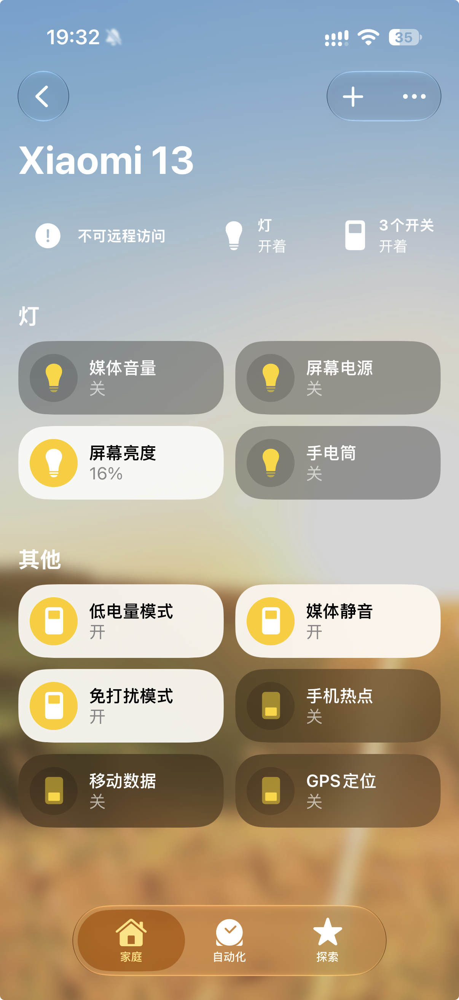

<h1 align="center">Marionette</h1>

<p align="center">
  <strong>将 Android 手机变成 Apple HomeKit BLE 配件</strong>
</p>

<p align="center">
  
  
  
  
</p>

---

Marionette 让一台已 Root 的 Android 手机通过 BLE 广播为 Apple HomeKit 配件，iPhone 家庭 App 可直接发现、配对并控制手机的系统功能——无需 HomeHub、无需 HomePod、无需公网。

## 截图

<table>
  <tr>
    <td align="center"><strong>iPhone 家庭 App 控制面板</strong></td>
  </tr>
  <tr>
    <td align="center">
      
    </td>
  </tr>
</table>

> **被控端**：小米 13 (Android 13, Root) &nbsp;|&nbsp; **控制端**：iPhone 17 (iOS, 家庭 App)

## 功能

| 控制项 | 类型 | 说明 |
|--------|------|------|
| 屏幕电源 | 按键 | 模拟电源键动作（非设置亮灭） |
| 屏幕亮度 | 滑块 0–100% | 实时同步系统亮度档位 |
| 媒体音量 | 滑块 0–100% | 实时同步系统媒体音量 |
| 手电筒 | 开关 | 控制相机闪光灯 LED |
| 手机热点 | 开关 | 启停 SoftAP 个人热点 |
| 移动数据 | 开关 | 切换蜂窝数据开关 |
| 媒体静音 | 开关 | 切换媒体静音状态 |
| GPS 定位 | 开关 | 切换位置服务 |
| 低电量模式 | 开关 | 切换系统省电模式 |
| 免打扰模式 | 开关 | 切换勿扰模式 |
| 电池状态 | 只读 | 电量百分比与充电状态 |

## 架构

```
iPhone 家庭 App
  └─ BLE 广播 / GATT / Pair Setup / Pair Verify / 加密 HAP
       └─ HomeKitRuntime (前台 Service)
            ├─ HAP 协议适配：服务、特征、IID、签名、读写、事件
            ├─ BLE 传输：GATT Server、Indicate、CCCD、广播刷新
            └─ HomeKitControlLifecycle
                 └─ AndroidCommandExecutor
                      └─ Android API / Root shell / sysfs
```

**设计原则**：单向依赖，模型统一。所有按钮的命令、名称、状态只在 `HomeKitControl.kt` 定义一次，HAP 层仅做协议适配，UI 层仅做投影展示。

## 环境要求

- 小米 13（或兼容的 Android 13+ 设备）
- 已解锁 Bootloader 并安装 [KernelSU](https://kernelsu.org/) 或其他 Root 方案
- iPhone 或 iPad（家庭 App）
- Android Studio (JBR 17+)
- Gradle 9.1+

## 构建与安装

```sh
# 1. 编译 Debug APK
JAVA_HOME='/Applications/Android Studio.app/Contents/jbr/Contents/Home' \
  gradle --offline --no-daemon :app:assembleDebug

# 2. 安装到设备（保留数据和配对身份）
adb install -r app/build/outputs/apk/debug/app-debug.apk

# 3. 启动服务
adb shell am force-stop dev.local.mihotspot
adb shell am start -n dev.local.mihotspot/.MainActivity
```

> ⚠️ 使用 `install -r` 升级会保留 HomeKit 配对身份。**不要**使用 `pm clear` 或卸载重装，除非你打算重新配对。

### KernelSU 模块

```sh
./build-kernelsu-module.sh
```

生成 `marionette-kernelsu-module.zip`，在 KernelSU Manager 中安装。建议先用 debug APK 验证协议稳定后再打包模块。

## 配对流程

1. **启动服务**：打开 App，确认日志中出现 `GATT_DATABASE_PUBLISHED services=14` 和 `BLE_ADVERTISING_STARTED`
2. **发现配件**：iPhone 家庭 App → 添加配件 → 扫描到 "Xiaomi 13"
3. **配对验证**：输入配对码（App 中显示），完成 Pair Setup + Pair Verify
4. **控制同步**：家庭 App 中出现所有控制项，状态自动同步

日志验证：

```sh
adb logcat -s MiHotspotHap:I '*:S'
```

关键日志顺序：`SERVICE_CREATED` → `GATT_DATABASE_PUBLISHED` → `BLE_ADVERTISING_STARTED` → `BLE_CONNECTION` → `PAIR_VERIFY_M4` → `CONTROL_SESSION_ACTIVE`

## 项目结构

```
app/src/main/java/dev/local/mihotspot/
├── homekit/
│   ├── controls/HomeKitControl.kt    # 按钮模型、生命周期、状态快照
│   ├── commands/
│   │   ├── AndroidCommandExecutor.kt  # Android/Root 系统执行
│   │   └── HomeKitCommand.kt         # 命令定义
│   └── HomeKitSetupPayload.kt       # 配对码
├── core/homekit/
│   ├── HomeKitRuntime.kt            # BLE/GATT/HAP 运行时
│   └── protocol/
│       └── HomeKitAccessoryCatalog.kt # HAP 服务/特征目录
├── domain/HomeKitFeature.kt          # UI 投影
├── ui/MainViewModel.kt              # UI 状态管理
├── data/
│   ├── AccessorySettingsRepository.kt
│   └── HotspotSettingsRepository.kt
└── HomeKitService.kt                # 前台 Service 入口
```

## 参考

- [Apple HomeKitADK](https://github.com/apple/HomeKitADK) — BLE 广播与事件实现的协议参考
- 本项目不使用 MFi 认证，仅供个人实验用途

## License

MIT
